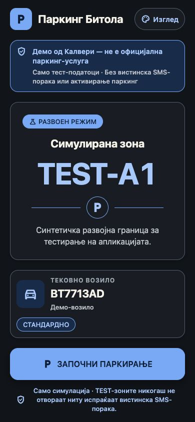
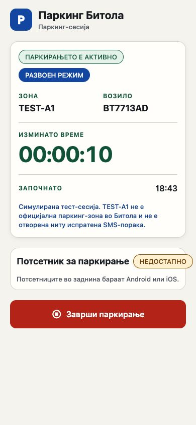
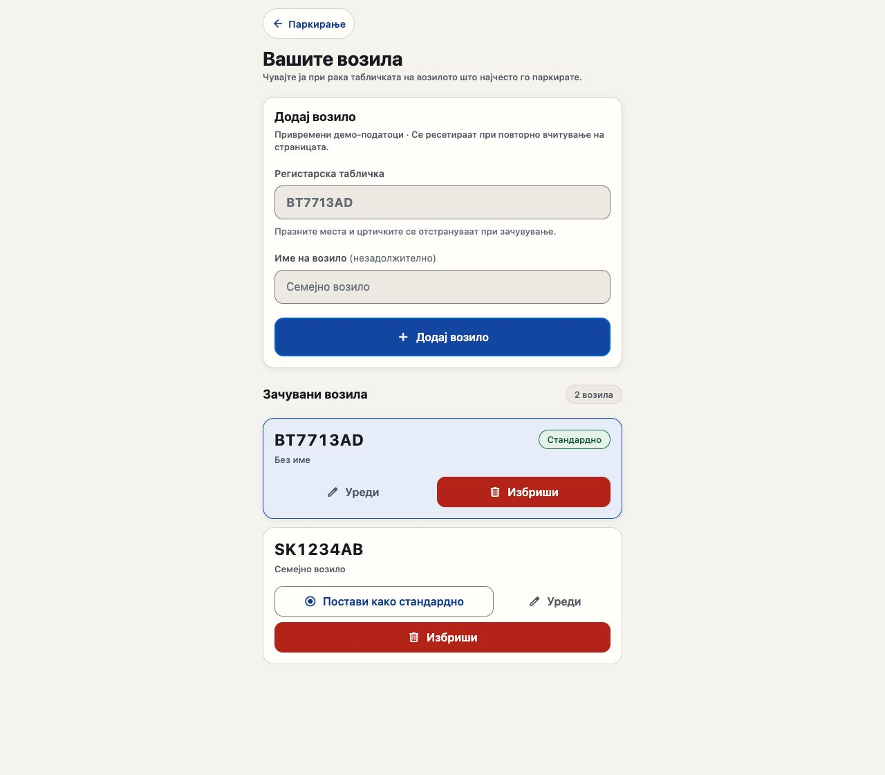
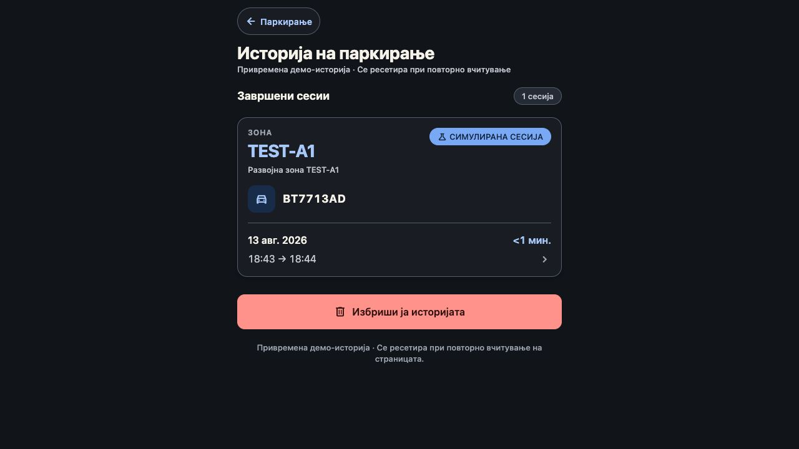
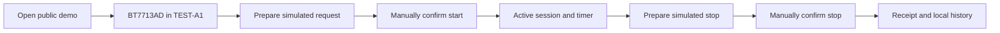

# Паркинг Битола / Parking Bitola

<p align="center">
  A bilingual, mobile-first parking pilot built by Kalveri with Expo, React Native, and TypeScript.
</p>

<p align="center">
  <a href="https://app.kalveri.com/?demo=1&lang=mk"><strong>Отвори го демото на македонски</strong></a>
  ·
  <a href="https://app.kalveri.com/?demo=1&lang=en"><strong>Open the demo in English</strong></a>
</p>

> [!IMPORTANT]
> This is a **Kalveri development pilot**, not an official Parking Bitola service. `TEST-A1` and `TEST-A2` are synthetic development zones. The public demo never opens or sends a real SMS and never activates real parking.

## Product preview

<table>
  <tr>
    <td align="center" width="50%">
      
      <br />
      <sub><strong>Home</strong> — test zone, sample vehicle, and safety-first start action</sub>
    </td>
    <td align="center" width="50%">
      
      <br />
      <sub><strong>Active session</strong> — elapsed time and explicit simulation status</sub>
    </td>
  </tr>
</table>

<table>
  <tr>
    <td align="center" width="50%">
      
      <br />
      <sub><strong>Vehicles</strong> — plate, optional vehicle name, and default selection</sub>
    </td>
    <td align="center" width="50%">
      
      <br />
      <sub><strong>History</strong> — a completed simulated session with time and duration</sub>
    </td>
  </tr>
</table>

## What is ready

- Macedonian, English, and system-language modes.
- Light, dark, and system appearance modes.
- Local vehicle profiles: add, edit, delete, and choose a default vehicle.
- Macedonian plate validation and normalization to uppercase without unnecessary spaces or hyphens.
- Explicit foreground-location permission, GPS status, accuracy, and recovery states.
- Polygon and MultiPolygon zone detection with Turf.
- A safe simulated lifecycle: prepare, manually confirm start, show an active timer, manually confirm stop, and create a receipt.
- Local, duplicate-safe parking history with delete-one and clear-all confirmation.
- Native SMS and background-departure-reminder foundations that remain fail-closed until production data and device testing are complete.

## Try the public demo

The meeting-safe demo is activated only by `?demo=1` on the web. No account or
password is required:

- Sample vehicle: `BT7713AD`
- Sample zone: `TEST-A1`
- Sample location: fixed synthetic coordinates inside the test polygon
- Storage: temporary and discarded when the page reloads
- Device access: no GPS, SMS, notification, or background-location request



At every step, the UI keeps the development status visible. Returning from an SMS composer would not prove that an operator accepted a request, so native start and stop confirmation also remain manual.

## Web and native capabilities

| Capability | Web | Android / iOS |
| --- | --- | --- |
| Deterministic public demo | Yes, with `?demo=1` | Use the web demo for meetings |
| Foreground GPS in normal mode | Browser permission over HTTPS | Native foreground permission |
| Real SMS composer | Unsupported | Foundation implemented but currently blocked by unverified production zones |
| Background departure reminder | Unsupported | Implemented; requires a custom development build and physical-device QA |
| Local state | Per browser | Per device |

The native reminder is conservative by default: at least two qualifying
readings over at least 60 seconds, a 200 m departure threshold, and location
accuracy no worse than 100 m. It schedules at most one local reminder per
session, never stores a route history, and never stops parking automatically.

## Architecture

| Area | Responsibility |
| --- | --- |
| `src/screens` | Home, vehicle management, appearance/language, session, and history flows |
| `src/components` | Reusable themed mobile UI primitives |
| `src/stores` | Zustand application state and local persistence |
| `src/services` | Location, SMS, notification, persistence, and background-task boundaries |
| `src/utils` | Validation, zone detection, SMS formatting, session state, dates, and distance logic |
| `src/data` | Synthetic test fixtures and a separate unverified Bitola catalogue |
| `src/types` | Vehicle, zone, tariff, session, reminder, and history domain models |
| `src/tasks` | Expo background departure callback |
| `src/localization` | Macedonian/English UI and native notification copy |
| `src/theme` | Semantic light/dark design tokens |
| `src/demo` | Public web demo isolation and deterministic sample state |

Business logic stays outside presentation components. Device APIs are isolated behind services, geospatial logic is isolated in utilities, and the web demo redirects persisted state to discard-only storage before hydration begins.

## Local development

### Requirements

- Node.js 22.13 or newer
- npm
- Expo-compatible Android/iOS tooling for native builds

```bash
git clone https://github.com/gunnero/parking_app.git
cd parking_app
npm ci
npm run web
```

Open the URL printed by Expo and append `?demo=1&lang=mk` for the deterministic Macedonian demo.

Other useful commands:

```bash
npm run ios
npm run android
npm run typecheck
npm run build:web
npx expo install --check
npx expo-doctor
```

`npm run build:web` writes the static Expo export to `dist/`.

## Data, privacy, and safety

- There is no account system, backend, analytics pipeline, payment flow, or cloud upload.
- Normal app state is stored locally with AsyncStorage. It is not encrypted at the application layer.
- Browser data is per-browser and can be removed when site data is cleared.
- Parking history contains a start-location snapshot when available, not a route history.
- `robots.txt` and response headers ask search engines not to index the public pilot. This is not access control.
- The repository and demo contain no official Bitola zone geometry, pricing, schedule, holiday, exemption, or operator-response data.

## Production readiness

The production Bitola catalogue is deliberately inactive and unverified. Before real parking can be enabled, Parking Bitola must approve and provide:

1. Authoritative GeoJSON zone boundaries, ownership, version, and update process.
2. Verified SMS short code, start/stop templates, plate rules, and a safe test environment.
3. Operator success and failure responses, including duplicate, expired, invalid, and insufficient-balance cases.
4. Tariffs, charging increments, schedules, holidays, exemptions, grace periods, and maximum stays.
5. Product name, visual identity, legal text, privacy notice, support contact, acceptance criteria, and named launch approvers.

Native SMS, notifications, background location, permission recovery, accessibility services, and large-text behavior still require physical-device verification before production release.
Background execution requires a custom development or standalone build; Expo Go cannot validate this path.

## Project documentation

- [Parking Bitola meeting brief](docs/parking-bitola-meeting-brief.md)
- [Design and interaction QA](design-qa.md)
- [Apache deployment guide](deploy/apache/README.md)
- [Expo SDK 57 documentation](https://docs.expo.dev/versions/v57.0.0/)

## License

This repository includes an MIT license. See [LICENSE](LICENSE) for its current terms.
